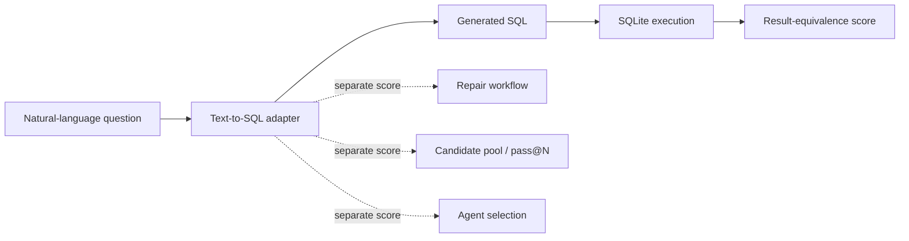
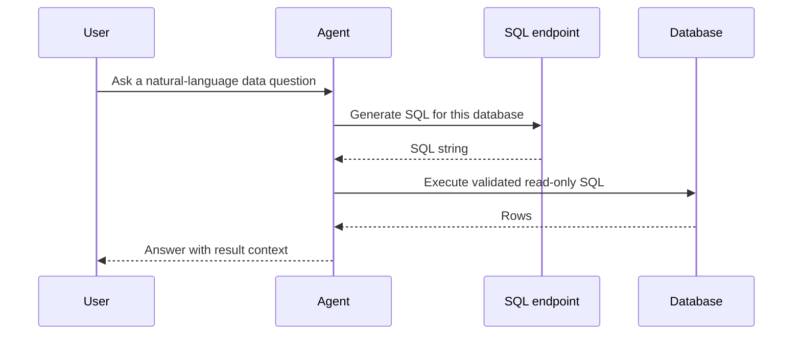
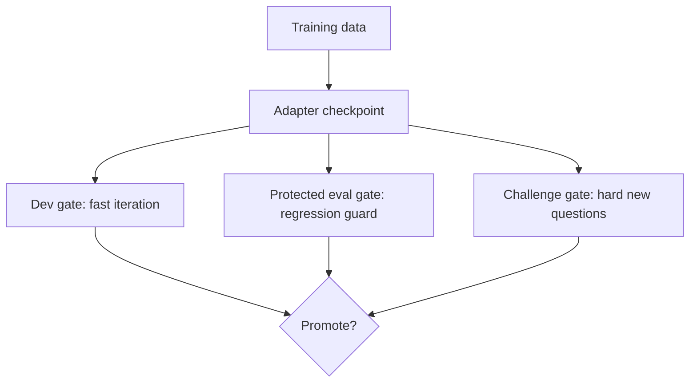
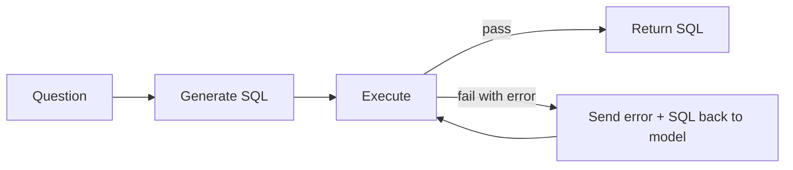

# The Measurement Boundary

How I learned to stop treating fine-tuning as one score and start treating it as a promise the system has to keep.

## The Setup

The project started with a small model and a narrow task: train a SQL adapter that could answer natural-language questions over a database.

That sounds like a modeling problem. In practice, the harder problem was deciding what exactly I was measuring.

The production-shaped version of the task was not:

> Build a general text-to-SQL model and claim a benchmark score.

It was:

> Build a specialized text-to-SQL endpoint for one known database, reliable enough for another agent to call when a user asks a natural-language question.

That distinction changed almost every engineering decision.

For a public benchmark, the headline is usually a single score. For an agent-facing endpoint, the question is more practical:

- Did the model generate executable SQL?
- Did it preserve behavior the agent already depended on?
- Did a new training run fix one type of query while breaking another?
- Did endpoint serving behave the same way as local offline eval?
- Was the result one-shot generation, repair, reranking, pass@N, or agent-selected SQL?

The first LLMOps lesson in this repo is that those are different measurements.

## The Boundary I Chose

I treated one-shot SQL generation as the first thing to measure.

By "one-shot," I mean the model gets one chance to produce SQL. No retry. No repair loop. No second model choosing between candidates.

Input:

- the user's natural-language question
- the database/schema context
- the fixed prompt format

Output:

- one SQL string

Then I evaluated that SQL by executing it and comparing the result to the expected result.

That meant the first measurement track did not include:

- execution-guided repair
- self-correction
- candidate pools
- reranking
- pass@N
- agent-level retries
- downstream answer synthesis

Those are all useful. Some are probably required for a real endpoint. But they need to be measured separately.

For example, `pass@N` asks whether any answer in a group of N generated SQL candidates is correct. That is a different question from whether the first SQL answer is correct.

If repair is mixed into the same score as one-shot generation, I can no longer answer the basic model question: did the adapter itself improve, or did the workflow compensate for it?

The dashed boxes are not bad. They are just not the same measurement.

That boundary is why the repo and docs keep repeating the same rule: one-shot generation, repair, reranking, candidate selection, and agentic workflows must be tracked separately.

## Why This Matters for an Agent Endpoint

The intended product shape is an agent that uses the SQL model as a tool.

In that setup, the model is not an isolated demo. It is a dependency.

If the adapter changes, the agent's behavior changes. If a trained model improves on a new hard test but gets worse on an older important query, that is a production problem even if the overall score looks better.

This is the key mental shift:

> For an agent-consumed endpoint, a model update is an API behavior change.

The API happens to be probabilistic, meaning the output comes from a model instead of fixed code. But the burden is the same: version it, test it before release, monitor it, and roll it back if needed.

## Same-DB Is a Legitimate Product Claim, Not a Benchmark Claim

The repo has two different measurement stories:

1. Broad text-to-SQL generalization across unseen databases.
2. Reliability for one known database behind an endpoint.

Those should not be confused.

Early experiments showed that same-database performance could look strong while new-database performance stayed weak. For example, Exp029 reached 40/40 on the regional_sales and superstore same-DB dev tests, but the restaurant+airline holdout was 4/50.

By "holdout," I mean data kept out of training and used only for evaluation. By "DB-disjoint," I mean the holdout uses different databases, not just different questions from the same database.

That is not a contradiction. It means the measurement claim must be named precisely.

Same-DB endpoint readiness says:

> This adapter is useful for this known schema and business domain under these local tests.

It does not say:

> This is a general SQL model.

It also does not say:

> This is an official LiveSQLBench score.

This distinction made the one-database storefront lab legitimate. The endpoint did not need arbitrary schema generalization. It needed stable behavior over known business semantics: orders, returns, shipments, support tickets, product categories, date boundaries, anti-joins, and revenue calculations.

## The Three Eval Surfaces

The useful pattern was not one eval set. It was multiple gates with different jobs.

By "gate," I mean a test the model must pass before I trust it for the next step.

Dev gates were for iteration. They helped answer: did the change improve the type of failure I was trying to fix?

Protected eval gates were for stability. They answered: did I break behavior that was already supposed to work?

Challenge gates were for discovery. They answered: where is the model still fragile?

Those gates are not interchangeable. A challenge gate can reveal a weakness without becoming the only release test. A protected eval gate can block a trained model even when that model improves the newest challenge.

That happened in the storefront sequence.

Exp056 was the strongest selected checkpoint. A "checkpoint" is just the saved model adapter from one training run.

- train split: storefront train_v4
- method: LoRA SFT
- base model: Qwen/Qwen3.5-0.8B-Base
- train rows: 200
- dev_v2: 11/12
- eval_v1: 12/12
- challenge_v1: 22/24

Then challenge_v2 exposed new brittleness. Exp062 bundled all hard-negative contrast families and improved challenge_v2 to 12/15. But it regressed eval_v1 from 12/12 to 11/12.

So I rejected it.

That decision is the measurement boundary in action. If the model is supposed to back an endpoint another agent depends on, the newest hard test does not get to erase the older test that protects known-good behavior.

## What Counts as Failure?

In text-to-SQL, failure is not just "the string differs from gold SQL."

The repo evaluates by execution and result equivalence. In plain terms: it runs the generated SQL and checks whether the returned rows match the expected rows. It does not require the SQL string to be identical.

That creates a more useful list of failure types:

- syntax failure: SQL does not parse or execute
- schema failure: SQL references the wrong table, column, or alias
- runtime failure: SQL executes incorrectly or errors during execution
- row-count mismatch: SQL returns too many or too few rows
- row-value mismatch: SQL returns plausible rows with wrong values
- semantic failure: SQL runs, but the meaning is wrong, such as an anti-join, date boundary, HAVING, return-ratio, or alias-ownership mistake

This matters because two failed queries may need completely different fixes.

A syntax failure might call for prompt constraints, decoding constraints, or repair.

A schema failure might call for better schema context or identifier-copy supervision.

A return-ratio failure might call for targeted examples around which value goes in the numerator and which value goes in the denominator.

An anti-join failure is a mistake in queries like "show customers with no orders." It might call for contrast rows around where the SQL filter belongs.

An aggregate score hides that. A list of failure types lets the next experiment be more specific.

## Why Repair Belongs Outside the First Score

Execution-guided repair is an obvious next workflow for SQL. It means: run the SQL, capture the database error if it fails, and send that error back to the model so it can try to fix the query.

The loop is straightforward:

I would absolutely add this to an agent endpoint. But I would not collapse it into the one-shot score.

The metrics should be separate:

- one-shot score
- repair score
- pass@N
- selected@1
- repair attempt count
- repair failure reason

`selected@1` means the final SQL chosen by the system is correct, even if the system generated several options internally.

Otherwise, the endpoint can appear to improve while the first SQL answer gets worse and the repair loop silently covers up the damage.

For a production system, that distinction matters. Repair costs extra model calls, adds latency, and can fail in its own way. It may change the problem from "bad SQL" to "the system keeps trying to repair bad SQL until it runs out of time."

## The First LLMOps Artifact Was Not a Pipeline

It was a decision rule.

Before Vertex jobs, before GCS publishing, before endpoint serving, the core object was:

> Given a manifest, train summary, eval results, failure analysis, and gate thresholds, should this adapter be promoted, rejected, or investigated?

A manifest is the run recipe: which model, which data, which training method, and where the outputs should go.

Said more simply:

> Given the files from this run, should this model be used, rejected, or studied more?

That is why the later MLOps work in the repo starts with explicit records:

- manifest-driven experiments
- fixed train/eval files
- train summaries
- eval result files
- failure analysis files
- explicit promote/reject decisions
- dev-only environment boundaries

The pipeline matters, but only after the decision rule is clear.

Without that decision rule, orchestration just makes unreliable work run faster. Orchestration means automation that runs the steps for you.

## The Practical Rule

The rule I would carry into any LLMOps project is:

> Track the smallest behavior your system depends on before tracking the workflow that fixes it after the fact.

For this repo, the smallest behavior was one-shot SQL generation for one known database.

That gave me a clean baseline. Once the baseline was measurable, I could add repair, candidate selection, endpoint eval, load tests, runtime monitoring, and promotion records without confusing what improved.

The point was never "fine-tune and hope."

The point was:

1. Define the product boundary.
2. Define what is being measured first.
3. Keep data, eval, repair, and serving claims separate.
4. Promote only when protected behavior holds.
5. Treat every model update like an operational change.

That is the foundation of the LLMOps loop in this case study.

## Case-Study Sources

Repo artifacts used for this draft:

- `experiments/sql/qwen35_0_8b__exp056_storefront_v4_lora_r16_a32_d010.json`
- `experiments/sql/qwen35_0_8b__exp062_storefront_v5_lora_r16_a32_d010.json`
- `results/sql/qwen35_0_8b__exp056_storefront_v4_lora_r16_a32_d010/`
- `results/sql/qwen35_0_8b__exp062_storefront_v5_lora_r16_a32_d010/`
- `src/sqlbench_lab/sql/evaluator.py`
- `src/sqlbench_lab/sql/eval_analysis.py`
- `src/sqlbench_lab/mlops/run_contract.py`
- `src/sqlbench_lab/docs_site/builder.py`
- `interview_text_to_sql_narrative.md`

Linear context used:

- `TAP-532`: practical SQL fine-tuning learning ledger
- `TAP-630`: SQL adapter MLOps dev loop
- `TAP-648`: dev-only environment contract
- `TAP-631`: workflow contract and artifact layout
- `TAP-649`: soft-production readiness umbrella

## Open Questions Before Publishing

- What should we call the consuming agent in the public version: "agent", "analytics agent", or something domain-specific?
- Should the post mention Qwen/Qwen3.5-0.8B-Base directly, or keep the first post model-agnostic and save model details for Post 2?
- Should screenshots from the browser docs be added, or should the diagrams stay as Mermaid for now?
