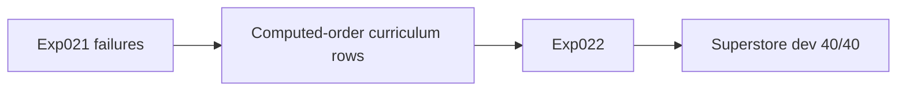
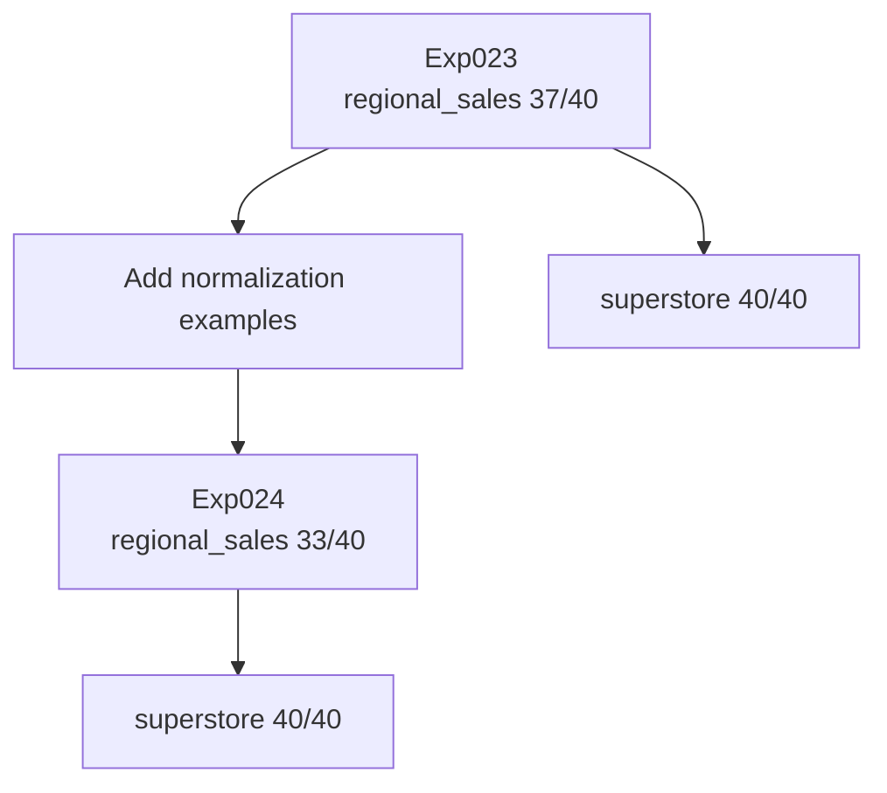
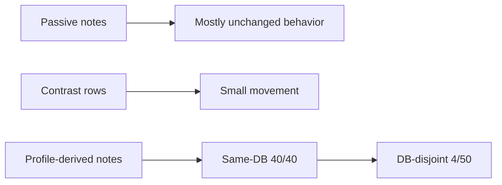
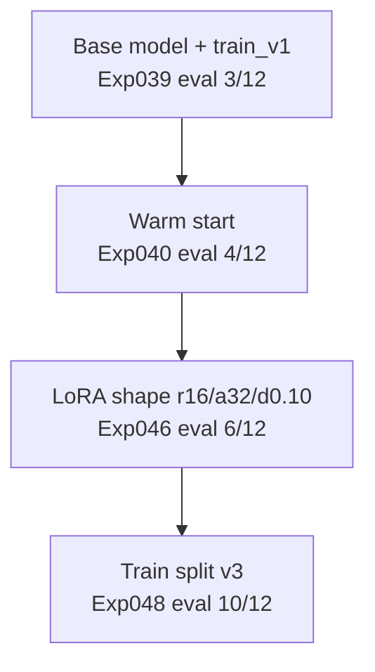
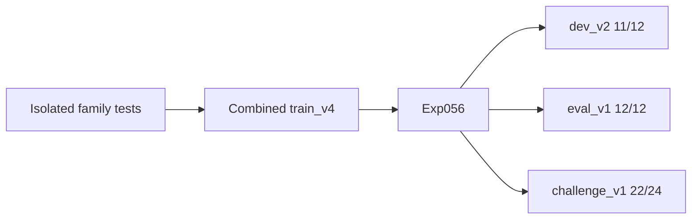
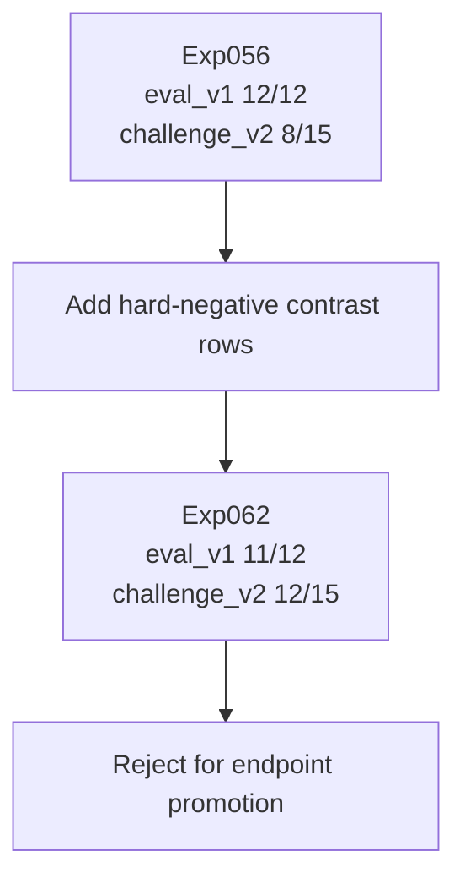
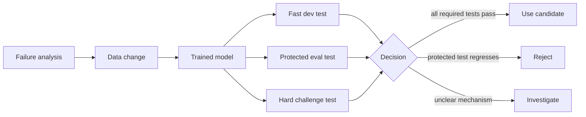

# Data Changes Are Production Changes

The most useful lesson from the SQL adapter experiments was not that more data helps. It was that every data change is a model behavior change.

That sounds obvious until you are looking at a trained model that improved the newest hard test and still should not ship.

## The Starting Assumption

The naive story of supervised fine-tuning is simple:

1. Find failures.
2. Add examples that teach the missing behavior.
3. Retrain.
4. Watch the score go up.

Some experiments followed that story.

Many did not.

The repo became useful because it treated data changes like controlled experiments. Each run had a manifest, fixed train inputs, fixed eval files, and a result file. That made it possible to ask a better question than "did the score improve?"

The better question was:

> What behavior did this data change move, and what behavior did it damage?

For an agent-facing SQL endpoint, that question matters more than the training recipe. The endpoint does not care that the new data looked reasonable. It only cares whether the generated SQL got better or worse.

## The First Scar: Targeted Data Can Work

The early single-DB curriculum experiments started with a BIRD-derived superstore lab.

By "curriculum," I mean a training set built to teach a specific SQL behavior instead of a random pile of examples.

Exp021 trained a LoRA adapter on one superstore schema lab and reached:

- superstore dev: 36/40

The failures were not random. They clustered around a concrete family: computed ordering over fact-table values.

Exp022 added a targeted curriculum for that family. The eval stayed fixed.

Result:

- superstore dev: 40/40

That is the clean version of the data story. A fixed eval exposed a failure family. The next dataset added examples for that family. The score moved.



The important part is not only that Exp022 improved. It improved against the same test.

Without the fixed eval, the result would have been hard to interpret. With the fixed eval, meaning the same questions scored the same way, the experiment taught a specific lesson:

> Targeted curriculum can close a concrete failure family when the failure is well localized.

That lesson later became dangerous when applied too broadly.

## The Second Scar: More Data Can Make the Model Worse

Exp023 added a second database, regional_sales, while keeping the superstore test in place.

Result:

- superstore dev: 40/40
- regional_sales dev: 37/40

That was useful. It showed that adding another database did not automatically destroy the first test, but it also exposed a new failure family: text-number normalization in regional_sales.

Text-number normalization means converting numbers stored as text into real numbers before doing math. In this case, values like `"1,234.56"` needed SQL that removed the comma and cast the result to a number.

The tempting next move was obvious: add more examples teaching normalization.

Exp024 did that.

Result:

- superstore dev: 40/40
- regional_sales dev: 33/40

The extra examples made the target test worse.



That is the first production-shaped scar.

If this adapter were backing an endpoint, "we added examples for the bug" would not be a sufficient explanation. The only thing that matters is whether the endpoint behavior improved on the required tests.

Exp024 taught the rule:

> Extra data is not automatically safer data.

The model did not receive "a fix." It received a new mix of examples, and that new mix changed its behavior.

## Passive Context Did Not Override an Entrenched Decode Path

The regional_sales sequence kept going.

Exp025 added a small side micro-lab for the normalization behavior. It preserved stability but did not override the target SQL shape.

Exp026 added passive column notes: sample values, intended normalization expressions, and prompt-visible metadata.

Passive notes means extra explanatory text. For example: this column stores numeric values as text, so normalize it before averaging. The model could read the note, but the note did not force the model to use the right SQL.

Result:

- regional_sales note-bearing dev: 37/40

Exp027 added direct contrast rows for unit-price target shape.

Contrast rows are examples designed to separate two similar behaviors. Here, the point was to show the model the difference between the wrong unit-price pattern and the correct normalized expression.

Result:

- regional_sales dev: 37/40

Exp028 changed the canonical training slot and moved regional_sales only modestly. In plain terms, it changed the main answer pattern the training data showed for this kind of question.

- regional_sales dev: 38/40

Exp029 added profile-derived column notes and finally reached:

- regional_sales dev: 40/40
- superstore dev: 40/40
- DB-disjoint restaurant+airline holdout: 4/50

There are two lessons here.

First, metadata can help, but only if it changes the model's actual output. Passive notes alone did not reliably override an entrenched decode path. That means the model had learned a strong habit for how to write this SQL, and simply telling it the rule in text was not enough to change that habit.

Second, same-DB mastery did not mean generalization. Exp029 looked excellent on the same-database tests and weak on the different-database holdout.

By "DB-disjoint holdout," I mean eval questions from databases that were kept out of that training path. It tests whether the behavior transfers beyond the database the model practiced on.



This is where the repo started forcing honest labels:

- same-DB local result
- DB-disjoint local result
- official benchmark result

Those are different claims.

## The Storefront Reset

The broad SQL work was useful, but the product-shaped endpoint story needed a tighter environment.

That led to the storefront single-database lab.

The storefront lab had:

- one SQLite database
- one known business domain
- one fixed canonical prompt, meaning the same prompt template each time
- TRL SFTTrainer
- assistant-SQL-only loss
- LoRA adapters against Qwen/Qwen3.5-0.8B-Base
- executable result-equivalence eval, meaning generated SQL was run and judged by returned rows
- separate dev, eval, and challenge gates

Here, a "gate" is just a required test. Dev was for fast iteration, eval was for protecting known-good behavior, and challenge was for hard new questions.

This was a better stand-in for the intended endpoint:

> A known database behind an agent, where the model's job is to produce SQL over that database reliably.

The early storefront runs showed that both training mechanics and data composition mattered.

Exp039 trained from the base model on train_v1:

- dev_v1: 8/12
- eval_v1: 3/12

Exp040 warm-started from the earlier Exp031 SQL/profile adapter:

- dev_v1: 11/12
- eval_v1: 4/12

That was not enough. Dev improved, but the protected eval was still weak. Protected eval means the test I used to catch regressions in behavior that should keep working.

Exp046 changed the LoRA shape on train_v2:

- LoRA rank: 16
- alpha: 32
- dropout: 0.10
- dev_v1: 11/12
- eval_v1: 6/12

Then Exp048 kept the LoRA recipe fixed and changed the train split to train_v3:

- dev_v1: 10/12
- eval_v1: 10/12
- challenge_v1: 15/24

That jump mattered because the main variable was data composition: what examples were in the training set.



The data had more leverage than the adapter mechanism at that point.

## Isolated Supplements Were Useful, But Not Enough

After Exp048, the next question was: which failure families should be added?

The repo tested isolated supplements: small add-on datasets focused on one failure type at a time.

- Exp051: support-ticket rows
- Exp052: date-boundary rows
- Exp053: return-ratio rows
- Exp054: HAVING/grouped-count rows
- Exp055: anti-join rows

The results were mixed:

| Experiment | Data family | dev_v2 | eval_v1 | challenge_v1 |
|---|---|---:|---:|---:|
| Exp051 | support tickets | 6/12 | 9/12 | 13/24 |
| Exp052 | date boundaries | 6/12 | 10/12 | 14/24 |
| Exp053 | return ratios | 8/12 | 10/12 | 17/24 |
| Exp054 | HAVING/grouped counts | 9/12 | 9/12 | 17/24 |
| Exp055 | anti-joins | 9/12 | 10/12 | 17/24 |

None of these was the final answer.

They were still valuable because they made the failures easier to understand. Exp053 looked like the strongest isolated family. Exp054 improved challenge_v1 but regressed eval_v1. Exp051 was a clear regression.

This is the difference between a learning experiment and a model I would actually use.

A learning experiment is allowed to teach one thing.

A model I would actually use has to preserve the system contract: the important old behavior must still work.

## The First Promoted Checkpoint

Exp056 combined the useful same-DB coverage into train_v4:

- support
- date boundaries
- return ratios
- HAVING/grouped counts
- anti-joins

It kept the LoRA recipe from the stronger storefront runs:

- LoRA rank: 16
- alpha: 32
- dropout: 0.10
- train rows: 200

Result:

- dev_v2: 11/12
- eval_v1: 12/12
- challenge_v1: 22/24

That was the first clean endpoint candidate. Candidate here means "good enough to consider using behind the agent," not "production-ready."

It did three things at once:

1. It improved the fast iteration test.
2. It preserved the protected eval test.
3. It improved the hard challenge test.



This is the shape I would want from a model I am considering for release.

Not "best number somewhere."

All required tests pass.

## QLoRA Was an Efficiency Tradeoff, Not the Quality Winner

Exp057 kept train_v4 fixed and changed the method from LoRA to QLoRA.

It was interesting from a cost and deployment point of view:

- same train rows: 200
- same train_v4 data
- QLoRA with 4-bit NF4
- dev_v2: 12/12
- eval_v1: 10/12
- challenge_v1: 22/24

It improved dev_v2, preserved challenge_v1, and regressed eval_v1. Regressed means the score went backward.

So it was not the preferred quality model.

That is the practical LoRA/QLoRA lesson from this case study. QLoRA may be attractive for memory and serving cost, but the decision still goes through the same tests.

For this endpoint, Exp056 full LoRA was the quality model. Exp057 QLoRA was an efficiency tradeoff that failed the protected eval requirement.

## The Hardest Scar: The New Challenge Improved, But Promotion Failed

After Exp056 looked strong, a fresh challenge_v2 test exposed brittleness. Brittleness means the model looked good on known tests but broke on a new version of the same kind of task.

- Exp056 challenge_v2: 8/15

The failures clustered around:

- alias ownership, meaning the SQL used the wrong table alias for a column
- boundary semantics, meaning off-by-one style mistakes like inclusive versus exclusive dates
- anti-join / left-join predicate placement, meaning the SQL put a filter in the wrong place when looking for missing related rows

The next experiments added hard-negative contrast rows: training examples built to force the model to distinguish between a tempting wrong pattern and the correct pattern.

In plain terms, a hard negative is a near miss. The question looks similar to another question, and the SQL looks almost the same, but one small choice changes the answer.

For example:

```text
Question A: How many completed orders were placed strictly before 2024-04-01?
SQL choice: order_date < '2024-04-01'

Question B: How many completed orders were placed on or before 2024-04-01?
SQL choice: order_date <= '2024-04-01'
```

That is a boundary contrast. The model has to learn that "strictly before" and "on or before" are not interchangeable.

Another hard negative was anti-join placement:

```sql
-- Correct shape for "customers with no unresolved support tickets"
LEFT JOIN support_tickets AS T2
  ON T1.customer_id = T2.customer_id AND T2.resolved = 0
WHERE T2.ticket_id IS NULL
```

The filter for unresolved tickets has to be part of the join condition. If it moves to the `WHERE` clause, the query no longer means "customers with no unresolved tickets."

- Exp059: alias contrast
- Exp060: boundary contrast
- Exp061: anti-join contrast
- Exp062: all contrast families bundled into train_v5

Results:

| Experiment | Change | dev_v2 | eval_v1 | challenge_v1 | challenge_v2 |
|---|---|---:|---:|---:|---:|
| Exp056 | promoted train_v4 | 11/12 | 12/12 | 22/24 | 8/15 |
| Exp059 | alias contrast | 12/12 | 12/12 | 22/24 | 9/15 |
| Exp060 | boundary contrast | 12/12 | 11/12 | 23/24 | 9/15 |
| Exp061 | anti-join contrast | 12/12 | 11/12 | 23/24 | 8/15 |
| Exp062 | all contrast families | 12/12 | 11/12 | 23/24 | 12/15 |

Exp062 is the scar that makes the whole lab credible.

It improved the newest challenge test from 8/15 to 12/15. It improved challenge_v1 from 22/24 to 23/24. It held dev_v2 at 12/12.

But it regressed protected eval_v1 from 12/12 to 11/12.

So it was rejected.



This is the point where fine-tuning stops being a leaderboard exercise.

If another agent depends on the endpoint, improving the newest stress test is not enough. The adapter must preserve the older behavior that users and downstream code already rely on.

## The Production Lesson

Data changes are production changes because they alter endpoint behavior.

That means a data PR should be treated like a code PR:

- What behavior is it intended to change?
- What stayed fixed?
- Which tests prove the intended behavior moved?
- Which protected tests prove existing behavior stayed intact?
- Which failure families changed?
- Is the result usable, learning-only, or rejected?



The model is not just a file sitting on disk. It is part of a tool contract: another system calls it and expects certain behavior.

In this repo, the safest model was not the one with the most exciting improvement on the newest hard test. It was the one that improved the target behavior without breaking the protected test.

That is the difference between experimentation and LLMOps.

## Case-Study Sources

Repo artifacts used for this draft:

- `experiments/sql/qwen35_0_8b__exp021_trl_superstore_schema_lab.json`
- `experiments/sql/qwen35_0_8b__exp022_trl_superstore_computed_order_v2.json`
- `experiments/sql/qwen35_0_8b__exp023_trl_superstore_regional_sales.json`
- `experiments/sql/qwen35_0_8b__exp024_trl_regional_sales_normalization_v2.json`
- `experiments/sql/qwen35_0_8b__exp029_trl_regional_sales_profile_notes.json`
- `experiments/sql/qwen35_0_8b__exp039_storefront_single_db_lab.json`
- `experiments/sql/qwen35_0_8b__exp046_storefront_v2_lora_r16_a32_d010.json`
- `experiments/sql/qwen35_0_8b__exp048_storefront_v3_lora_r16_a32_d010.json`
- `experiments/sql/qwen35_0_8b__exp056_storefront_v4_lora_r16_a32_d010.json`
- `experiments/sql/qwen35_0_8b__exp057_storefront_v4_qlora_r16_a32_d010.json`
- `experiments/sql/qwen35_0_8b__exp062_storefront_v5_lora_r16_a32_d010.json`
- `results/sql/`
- `artifacts/sql/`
- `interview_text_to_sql_narrative.md`

Linear context used:

- `TAP-532`: practical SQL fine-tuning learning ledger
- `TAP-533`: fixed eval gates matter before scaling data
- `TAP-540`: targeted curriculum can close a concrete failure family
- `TAP-542`: extra examples can introduce new regressions
- `TAP-545`: side micro-lab preserved stability but did not override target SQL shape
- `TAP-547`: passive column notes did not change an entrenched decode path
- `TAP-549`: contrast rows still did not move unit-price decode path

## Open Questions Before Publishing

- Should this post include the full Exp051-Exp062 table, or split the contrast experiments into their own shorter post?
- Should QLoRA stay here as a data/control comparison, or move into a later serving/cost post?
- Do we want to say "promoted" publicly, or use a softer phrase like "selected as the best local endpoint candidate"?
