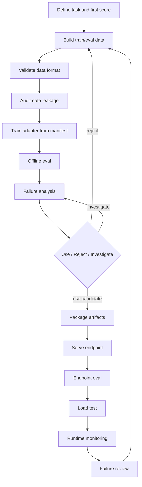
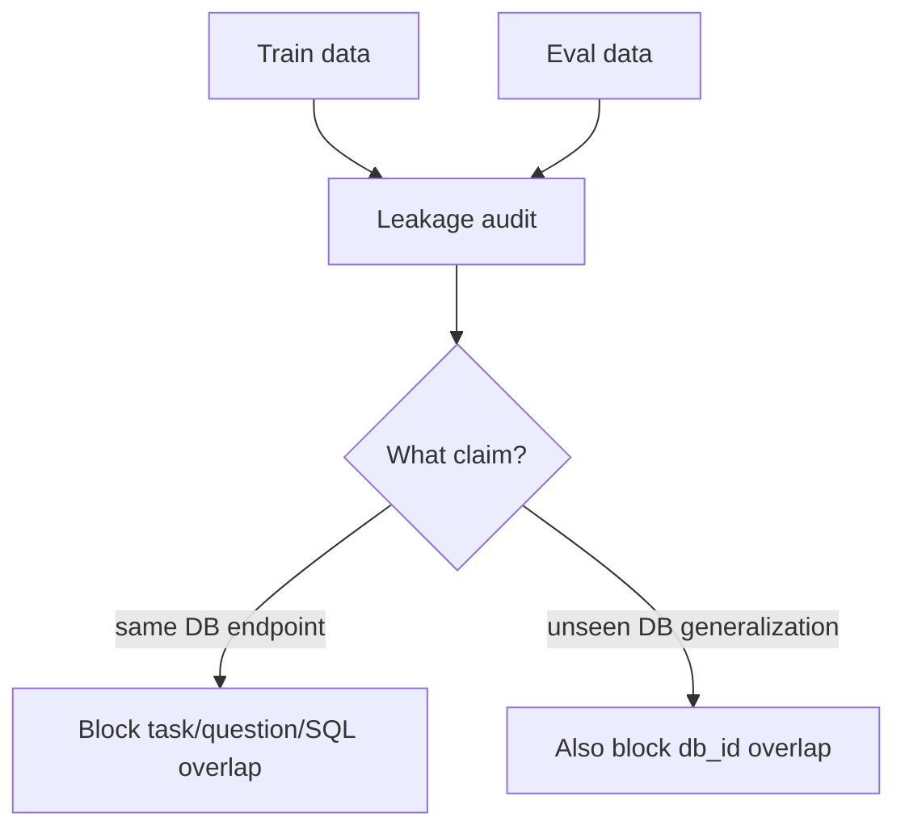

# The LLMOps Loop Is the Product

Fine-tuning is one step. The real product is the loop that turns failures into measured, reviewable model changes.

The bad loop is:

```text
train model -> deploy model -> hope
```

The reliable loop is:

```text
define task
-> audit data
-> train adapter
-> run offline eval
-> analyze failures
-> decide use / reject / investigate
-> package artifacts
-> serve endpoint
-> run endpoint eval
-> run load test
-> monitor runtime behavior
-> feed reviewed failures back into data and eval
```

The important idea is simple:

> Every step should leave behind a file or record that the next step can check.

If a step only lives in a notebook, terminal scrollback, or memory, it is weak LLMOps. It might be useful research, but it is not yet a reliable loop.

## The Loop



This post is about the loop shape. The details matter because each arrow is a place where ML projects usually become informal.

## 1. Define the Task and First Score

Before training, define what is being measured.

In this repo, the first score was:

```text
one known database
natural-language question in
SQL out
one generated SQL answer
execute SQL
compare returned rows
```

This is one-shot SQL generation. The model gets one chance to answer.

Repair, reranking, pass@N, and agent workflows are separate scores. They can be added later, but they should not be mixed into the first score.

Why this matters:

> If repair is mixed into the base score, I cannot tell whether the model improved or whether the repair loop covered for it.

The first step in the loop is not "pick a trainer." It is "say exactly what success means."

## 2. Build and Validate Data

Data is not just examples.

For this repo, data needed contracts:

- train example schema
- eval case schema
- repair example schema
- experiment manifest schema
- database ID
- SQL dialect
- expected SQL or expected result
- prompt context
- split identity

The goal is boring but important:

> Bad data should fail before training starts.

If a train row is malformed, the run should stop. If an eval row is missing the expected SQL, the run should stop. If a manifest points to the wrong files, the run should stop.

That is why schema validation belongs near the front of the loop.

## 3. Audit Data Leakage

Data leakage means the eval is accidentally too easy because the answer, question, or database was already seen in training.

In text-to-SQL, leakage can happen in multiple ways:

- the same task ID appears in train and eval
- the same question appears in train and eval
- the same gold SQL appears in train and eval
- the same database appears in train and eval when the claim is unseen-database generalization

The repo has a CLI command for this:

```bash
uv run python -m sqlbench_lab.cli sql audit-leakage \
  --train-dataset datasets/sql/train/<train>.jsonl \
  --eval-dataset datasets/sql/eval/<eval>.jsonl
```

That checks exact overlap for:

- task IDs
- normalized questions
- normalized SQL

Normalized means whitespace and casing differences are ignored. For example, `SELECT name FROM people;` and `select name from people` are treated as the same SQL.

For unseen-database evaluation, add:

```bash
uv run python -m sqlbench_lab.cli sql audit-leakage \
  --train-dataset datasets/sql/train/<train>.jsonl \
  --eval-dataset datasets/sql/eval/<unseen>.jsonl \
  --require-db-disjoint
```

`--require-db-disjoint` means train and eval cannot share a `db_id`.

This flag is important because not every eval has the same claim.

For a same-database endpoint, shared `db_id` is allowed. The whole point is to evaluate behavior on one known database. But exact question or SQL overlap is still a problem.

For unseen-database generalization, shared `db_id` is not allowed. If the model trained on the same database, the eval no longer proves transfer to a new database.



The rule is:

> Audit leakage against the claim you are making.

Same-DB endpoint readiness and unseen-DB generalization are different claims. They need different leakage rules.

## 4. Train From a Manifest

Training should be manifest-driven.

A manifest is the run recipe. It says:

- base model
- adapter name
- train datasets
- output paths
- LoRA or QLoRA settings
- prompt style
- trainer config

The training command should not depend on notebook memory.

The shape should be:

```bash
uv run python -m sqlbench_lab.cli sql run-sft \
  --manifest experiments/sql/<experiment>.json
```

This is what makes the run reproducible. A person, CI job, Docker container, or cloud job can all point at the same manifest.

## 5. Run Offline Eval

Offline eval is the first quality gate.

For text-to-SQL, offline eval means:

1. Render the prompt.
2. Generate SQL.
3. Execute the SQL.
4. Compare returned rows to the expected rows.
5. Write a result file.

The repo uses separate tests for separate jobs:

- dev: fast iteration
- protected eval: catch regressions in behavior that should keep working
- challenge: hard new questions
- DB-disjoint holdout: test transfer to new databases, when that is the claim

One eval file is not enough because one score can hide movement in the wrong direction.

Exp062 is the example: it improved challenge_v2 but regressed protected eval_v1. The loop caught that because both tests existed.

## 6. Analyze Failures

A score tells you how many passed. It does not tell you what to do next.

Failure analysis turns failed cases into useful categories:

- syntax failure
- schema failure
- runtime failure
- row-count mismatch
- row-value mismatch
- alias ownership
- date boundary
- anti-join predicate placement
- return-ratio denominator
- HAVING or grouped-count failure

This is the step that turns "11/12" into an engineering decision.

If the failure is syntax, repair or decoding constraints may help.

If the failure is schema ownership, the model may need better schema grounding or contrast rows.

If the failure is an anti-join, the model may need examples that show exactly where the left-join filter belongs.

Without failure analysis, the next data change is mostly guessing.

## 7. Decide: Use, Reject, or Investigate

The decision should be written down as data.

Example:

```json
{
  "decision": "reject",
  "passed_gates": ["train", "dev_v2", "challenge_v1", "challenge_v2"],
  "failed_gates": ["eval_v1"],
  "reasons": ["protected eval regressed from 12/12 to 11/12"]
}
```

This is the center of the loop.

The decision should not be:

```text
This run feels better.
```

It should be:

```text
This run passed these gates, failed these gates, and is accepted/rejected for these reasons.
```

In the storefront sequence, Exp056 was the better endpoint candidate because it passed the required tests. Exp062 taught something useful, but it regressed protected eval and should not replace Exp056.

## 8. Package Artifacts

A useful model is more than weights.

A package should include:

- manifest
- adapter files
- tokenizer/config files if required
- train summary
- eval results
- failure analysis
- decision record
- artifact hashes
- environment metadata
- git SHA
- container image URI when relevant

This is what lets another engineer answer:

- What trained this adapter?
- What data did it use?
- What did it pass?
- What did it fail?
- Which exact files should serving load?
- Can this artifact be verified after upload?

If those answers are scattered across memory and terminal logs, the loop is not ready for handoff.

## 9. Serve the Endpoint

Serving is a separate failure mode.

Offline eval passing does not prove serving works.

The endpoint still has to prove:

- it loads the right base model
- it loads the right LoRA adapter
- clients call the adapter model name, not the base model name
- context length is configured
- GPU memory settings are explicit
- health checks work
- generated SQL matches offline behavior closely enough to trust

This is why endpoint eval is a separate step. A model can look good offline and still fail because the serving process loaded the wrong model or served the wrong name.

## 10. Run Endpoint Eval and Load Test

Endpoint eval asks:

> Does the live endpoint generate correct SQL?

Load test asks:

> Does it keep working under expected concurrency and latency?

Track at least:

- request count
- concurrency
- success count
- timeout count
- p50/p95 latency
- generated SQL length
- endpoint errors
- SQL validation failures

The score from a local Python eval and the score from a live OpenAI-compatible endpoint should be stored separately.

They answer different questions.

## 11. Monitor Runtime Behavior

Runtime monitoring is not only CPU, GPU, and latency.

For LLMOps, quality signals matter too:

- SQL syntax failures
- SQL schema failures
- SQL runtime failures
- empty SQL rate
- repair rate, if repair is enabled
- repeated failure families
- request patterns that were not represented in eval

Infrastructure monitoring tells you whether the service is up.

Quality monitoring tells you whether the model is still useful.

Both are needed.

## 12. Feed Reviewed Failures Back Into Data and Eval

The loop closes when production-like failures become measured changes.

The bad version is:

```text
production failure -> add to train -> retrain
```

The better version is:

```text
production failure
-> classify
-> decide whether it belongs in replay eval
-> check for sensitive data
-> audit leakage
-> decide whether prompt, data, repair, or serving should change
-> retrain only if needed
```

Not every failure should become a train row. Some failures should become eval rows. Some should become SQL safety rules. Some should become endpoint fixes. Some should become repair examples.

The point is not to feed the model every mistake.

The point is to make failures reviewable and measurable.

## Why the CLI Matters

The CLI is what makes the loop executable.

The loop should not depend on a person remembering notebook cells. It should depend on commands:

```bash
sql validate-manifest
sql audit-leakage
sql run-sft
sql eval
sql analyze-eval
sql eval-repair
sql eval-candidates
mlops dev-cloud-plan
```

The orchestrator can be Metaflow, Docker, CI, or Vertex. The important thing is that those systems call the same command contract.

The principle is:

> The orchestrator sequences commands. The CLI owns the task logic.

That keeps local development, containers, and cloud jobs aligned.

## The Loop in One Sentence

A reliable LLMOps loop is a closed measurement system:

> every model change is tied to data, every data change is tied to eval, every eval is tied to a decision, every decision is tied to artifacts, and every served endpoint feeds reviewed failures back into the next measured change.

## Case-Study Sources

Repo artifacts used for this draft:

- `src/sqlbench_lab/sql/leakage.py`
- `src/sqlbench_lab/cli.py`
- `src/sqlbench_lab/mlops/run_contract.py`
- `src/sqlbench_lab/mlops/dev_cloud_bundle.py`
- `src/sqlbench_lab/mlops/dev_cloud_publish.py`
- `src/sqlbench_lab/mlops/dev_endpoint.py`
- `tests/test_sql_pipeline.py`
- `src/sqlbench_lab/docs_site/builder.py`

Linear context used:

- `TAP-630`: SQL adapter MLOps dev loop
- `TAP-631`: workflow contract and artifact layout
- `TAP-632`: local/dev Metaflow flow
- `TAP-633`: endpoint eval and load-test gates
- `TAP-634`: dev GCS artifact sync
- `TAP-635`: containerized train/eval/serving-test commands
- `TAP-649`: soft-production readiness umbrella

## Open Questions Before Publishing

- Should this post stay loop-focused, or should the CLI section become its own next post?
- Should the leakage section include a real Exp056 command with concrete train/eval paths?
- Should "Use / Reject / Investigate" be renamed to match the repo's `promote`, `reject`, and `investigate` decision values?
