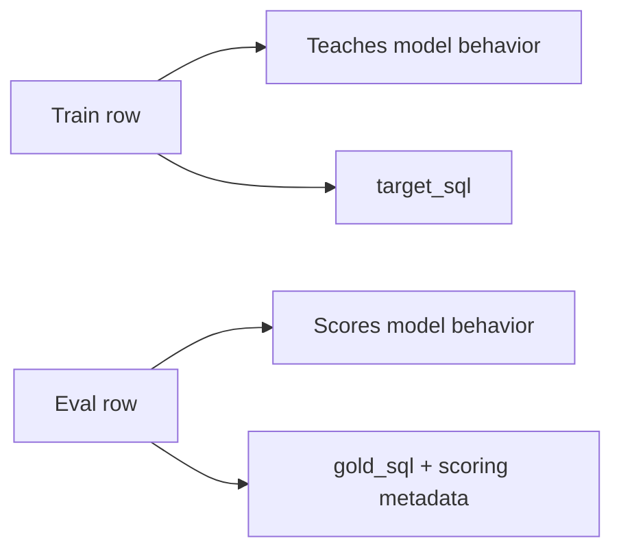
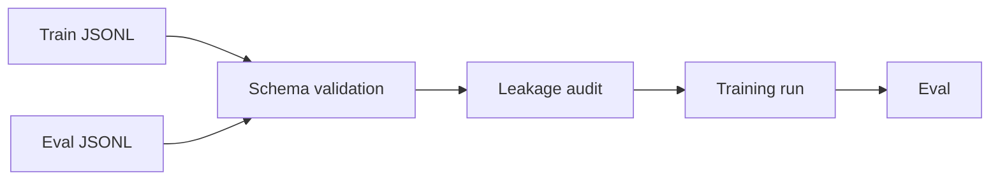

# Dataset Contracts Make Inputs Enforceable

The manifest made a run reproducible. The dataset contracts made the inputs enforceable.

That distinction matters.

A manifest can say:

```text
train on storefront_sales_lab_train_v4.jsonl
```

But the manifest does not prove that every row inside that file is valid. For that, the data itself needs a contract.

In this repo, the contract was a JSON schema for each dataset type:

- SQL train examples
- SQL eval cases
- SQL repair examples

This post focuses on train and eval because they are the heart of the loop.

## Why Dataset Contracts Matter

Without a data contract, "training data" can quietly mean anything:

- missing SQL
- wrong database ID
- unsupported SQL dialect
- malformed schema text
- duplicate row IDs
- accidental eval rows in train
- optional metadata in inconsistent shapes

That is dangerous because bad data does not always crash training. Sometimes it trains successfully and makes the model worse.

The goal of validation is simple:

> Bad data should fail before training starts.

This is one of the cheapest reliability wins in an LLMOps loop.

## Train Rows Teach the Model

A train row is a supervised example. It tells the model:

```text
given this question and database context,
produce this SQL
```

In the repo, a train row has fields like:

```json
{
  "schema_version": "sql_train_example:v1",
  "row_id": "storefront_sales_lab_train_v4_001",
  "task_id": "storefront_sales_lab_train_v4_001",
  "db_id": "storefront_sales_lab",
  "db_path": "datasets/sql/dbs/storefront_sales_lab/storefront_sales_lab.sqlite",
  "dialect": "sqlite",
  "question": "What is the discounted completed-order revenue for customers in the Northeast region?",
  "schema_text": "CREATE TABLE customers (...);",
  "knowledge_text": "completed-order revenue uses orders.status = 'completed' and applies discount_pct to every item.",
  "column_value_notes": [
    "orders.status values are 'completed', 'cancelled', or 'pending'; revenue tasks use completed orders only unless stated otherwise."
  ],
  "target_sql": "SELECT ROUND(SUM(...), 2) FROM customers ...",
  "task_type": "select",
  "provenance": {
    "created_by": "scripts/create_storefront_sql_lab.py",
    "teacher_model": null,
    "source_path": "scripts/create_storefront_sql_lab.py"
  },
  "tags": ["single_db_lab", "revenue", "join"]
}
```

The key fields:

- `schema_version`: which row contract this follows
- `row_id`: unique row identity inside the file
- `task_id`: task identity used for leakage checks
- `db_id`: which database the row belongs to
- `db_path`: where the SQLite database lives, when available
- `dialect`: SQL dialect, usually SQLite in this lab
- `question`: natural-language input
- `schema_text`: schema context shown to the model
- `knowledge_text`: optional domain hint
- `column_value_notes`: optional notes about values and business rules
- `target_sql`: SQL the model should learn to produce
- `provenance`: where the row came from
- `tags`: labels for failure family or dataset slice

The important distinction:

> Train rows are supervision. They shape model behavior.

That is why a bad train row is expensive. If it teaches the wrong SQL pattern, the model may learn it.

## Eval Rows Score the Model

An eval row is different. It is not used to teach the model. It is used to score behavior.

An eval row says:

```text
given this question and database context,
the model should generate SQL that returns the same result as this gold SQL
```

In the repo, an eval row has fields like:

```json
{
  "schema_version": "sql_eval_case:v1",
  "case_id": "storefront_sales_lab_eval_001",
  "task_id": "storefront_sales_lab_eval_001",
  "fixture_id": "storefront_sales_lab",
  "db_id": "storefront_sales_lab",
  "db_path": "datasets/sql/dbs/storefront_sales_lab/storefront_sales_lab.sqlite",
  "dialect": "sqlite",
  "question": "What discounted completed-order revenue was generated on or after 2024-04-01?",
  "schema_text": "CREATE TABLE customers (...);",
  "knowledge_text": "completed-order revenue applies discount_pct to item totals.",
  "gold_sql": "SELECT ROUND(SUM(...), 2) FROM orders ...",
  "task_type": "select",
  "order_sensitive": false,
  "numeric_tolerance": 0.001,
  "tags": ["single_db_lab", "eval_holdout", "revenue"]
}
```

The eval-specific fields matter:

- `case_id`: unique eval case identity
- `fixture_id`: which database fixture to run against
- `gold_sql`: reference SQL used for scoring
- `order_sensitive`: whether row order matters
- `numeric_tolerance`: how much numeric difference is allowed

The important distinction:

> Eval rows are measurement. They should not become training rows unless deliberately reviewed and moved through the loop.

## Why Train and Eval Schemas Differ

Train rows and eval rows look similar because both need question, schema, database, and SQL.

But they are not the same object.



A train row needs enough information to render a supervised prompt and target answer.

An eval row needs enough information to execute and judge the generated SQL.

That is why eval has fields like:

- `fixture_id`
- `order_sensitive`
- `numeric_tolerance`

Those fields are not training details. They are scoring details.

## What Validation Checks

The repo has strict loaders for train and eval data. They read JSONL, validate each row against the right JSON schema, reject duplicate row IDs, and return typed Python objects.

Command shape:

```bash
uv run python -m sqlbench_lab.cli sql validate-train \
  --dataset datasets/sql/train/storefront_sales_lab_train_v4.jsonl
```

And:

```bash
uv run python -m sqlbench_lab.cli sql validate-eval \
  --dataset datasets/sql/eval/storefront_sales_lab_eval_v1.jsonl
```

Validation catches:

- invalid JSONL
- empty dataset
- missing required fields
- wrong `schema_version`
- wrong data types
- unsupported `source_benchmark`
- unsupported `source_split`
- unsupported `dialect`
- missing `question`
- missing `schema_text`
- missing `target_sql` or `gold_sql`
- malformed `provenance`
- duplicate `row_id` or `case_id`
- unexpected extra fields

The "unexpected extra fields" part matters. The schemas use `additionalProperties: false`, which means a row cannot silently carry random fields that the pipeline ignores.

That is a good fail-hard rule.

## What Validation Does Not Prove

Validation proves the row has the right shape.

It does not prove the row is a good training example.

It does not prove:

- the train `target_sql` executes
- the train `target_sql` is semantically ideal
- the question is natural
- the example is useful
- the train row improves the model
- the eval case is hard enough
- the dataset has no leakage

This is where people overclaim validation.

Validation says:

> This row follows the contract.

It does not say:

> This row is correct and useful.

That is why validation is followed by leakage audit, training, eval, and failure analysis.

## Should Train SQL Be Executed Too?

In eval, generated SQL is executed against the SQLite database and compared to expected results.

For train validation, the current contract is mostly structural: does the row have the right fields, types, and schema?

A stronger hardening step would be:

```text
for each new train row:
  run target_sql against db_path
  fail if syntax, schema, or runtime error
```

That would catch bad supervision before a GPU run.

This is the honest framing:

> Today, train validation proves structure. A future hardening step should also execute new train SQL to catch broken supervision earlier.

That is a good production-readiness point because it shows the difference between current system guarantees and the next reliability improvement.

## How This Helped Experiments

Dataset contracts made experiments easier to compare.

When Exp056 trained on:

```text
datasets/sql/train/storefront_sales_lab_train_v4.jsonl
```

the training code could assume every row had:

- a question
- schema context
- target SQL
- database identity
- tags
- provenance

That meant the experiment question could move up a level:

```text
Did train_v4 improve behavior compared with train_v3?
```

instead of:

```text
Did the training file even have the fields the trainer expected?
```

This matters more as experiments multiply.

Once there are dozens of experiment manifests, the only way to keep the work sane is to make the input contracts boring.

## How This Helped Operationalizing

The dataset contract made the CLI reliable.

The CLI commands could fail before expensive work:

```text
validate train
validate eval
audit leakage
then train
```

That order matters.



The cheap checks happen first. GPU work happens later.

That is a recurring LLMOps design rule:

> Put cheap deterministic checks before expensive model work.

## How This Helps Production Handoff

A platform engineer does not want "a folder of examples."

They want to know:

- what file format is supported
- what fields are required
- what values are allowed
- what command validates the file
- what command fails on bad input
- what output path the next step consumes

Dataset contracts answer those questions.

They also make future automation safer:

- CI can validate new datasets.
- A data build job can reject malformed rows.
- A cloud training job can fail before GPU allocation.
- A replay-eval builder can enforce eval schema.
- A registry can store dataset URIs with confidence that they passed validation.

That is why dataset contracts are not paperwork.

They are a production interface.

## Interview Answer

If asked "what did your dataset contracts look like?", I would say:

```text
I separated train examples from eval cases. Train rows had question, schema context, target SQL, database identity, provenance, and tags. Eval rows had similar context, but used gold_sql plus scoring metadata like fixture_id, order_sensitive, and numeric_tolerance.

Both were JSONL files validated against explicit JSON schemas. The loaders rejected missing fields, wrong types, unsupported enum values, duplicate IDs, and unexpected extra fields.

That meant bad data failed before training or eval. It also made leakage audit, experiment comparison, and later MLOps planning much cleaner because every downstream step could rely on the same data contract.
```

Shorter:

```text
The manifest made the run reproducible. The dataset schema made the rows enforceable.
```

## Case-Study Sources

Repo artifacts used for this draft:

- `schemas/sql_train_example_v1.schema.json`
- `schemas/sql_eval_case_v1.schema.json`
- `schemas/sql_repair_example_v1.schema.json`
- `src/sqlbench_lab/sql/models.py`
- `src/sqlbench_lab/sql/loaders.py`
- `datasets/sql/train/storefront_sales_lab_train_v4.jsonl`
- `datasets/sql/eval/storefront_sales_lab_eval_v1.jsonl`

## Open Questions Before Publishing

- Should the public post include real row snippets, or should the JSON examples stay shortened?
- Should train SQL execution be framed as "missing production hardening" or "planned reliability improvement"?
- Should repair examples get their own later post when we cover execution-guided repair?
