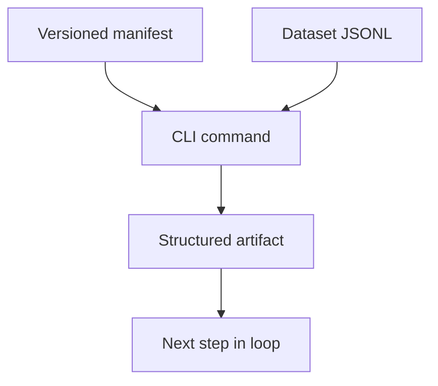
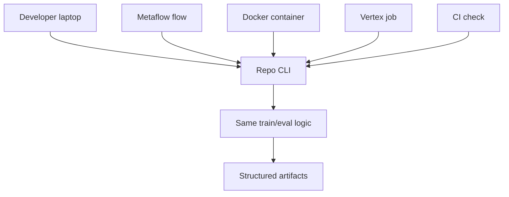

# The Manifest Is the Recipe, the CLI Is the Control Surface

The manifest made experiments reproducible. The CLI made them executable.

That pair is what moved the work from "I ran a fine-tuning script" toward an LLMOps loop.

The short version:

```text
manifest = what should happen
CLI = how the system runs it
artifacts = what happened
```

If dataset contracts make the inputs enforceable, the manifest and CLI make the workflow repeatable.

## The Problem With Notebook Memory

Notebooks are useful for exploration.

They are weak as operational contracts.

A notebook can hide too much:

- which exact train file was used
- which eval file was used
- which base model was loaded
- which LoRA settings were changed
- where the adapter was saved
- whether leakage was audited
- which command produced the result
- which step should run in Docker, Metaflow, CI, or GCP

That is fine early in research. It becomes dangerous once model updates affect an endpoint another agent depends on.

The fix is not "never use notebooks."

The fix is:

> Move the durable run recipe into a versioned manifest, and make the CLI consume that manifest.

## What the Manifest Captured

A manifest is the experiment recipe.

In this repo, Exp056 had a manifest at:

```text
experiments/sql/qwen35_0_8b__exp056_storefront_v4_lora_r16_a32_d010.json
```

Simplified, it looked like this:

```json
{
  "schema_version": "sql_sft_experiment:v1",
  "experiment_id": "qwen35_0_8b__exp056_storefront_v4_lora_r16_a32_d010",
  "student": {
    "model_family": "qwen35",
    "base_model": "Qwen/Qwen3.5-0.8B-Base",
    "adapter_name": "qwen35_0_8b_storefront_v4_lora_r16_a32_d010_exp056"
  },
  "training_method": {
    "method": "lora_sft",
    "loss_target": "assistant_sql_only",
    "stage": "direct_sql_sft"
  },
  "prompt": {
    "style": "canonical_chat"
  },
  "train_inputs": {
    "train_datasets": [
      "datasets/sql/train/storefront_sales_lab_train_v4.jsonl"
    ]
  },
  "trainer": {
    "backend": "trl_sft_trainer",
    "num_train_epochs": 3.0,
    "learning_rate": 0.0002,
    "max_length": 1536,
    "packing": false
  },
  "lora": {
    "r": 16,
    "lora_alpha": 32,
    "lora_dropout": 0.1
  },
  "eval_plan": {
    "smoke_dataset": "datasets/sql/eval/storefront_sales_lab_dev_v2.jsonl"
  },
  "output_paths": {
    "experiment_root": "artifacts/sql/qwen35_0_8b__exp056_storefront_v4_lora_r16_a32_d010",
    "adapter_dir": "artifacts/sql/qwen35_0_8b__exp056_storefront_v4_lora_r16_a32_d010/adapter",
    "train_summary_json": "artifacts/sql/qwen35_0_8b__exp056_storefront_v4_lora_r16_a32_d010/train_summary.json"
  }
}
```

The important sections:

- `schema_version`: which manifest contract this file follows
- `experiment_id`: stable run identity
- `student`: base model and adapter name
- `training_method`: LoRA/QLoRA SFT, loss target, and stage
- `prompt`: prompt style used for training and eval
- `train_inputs`: exact train datasets
- `trainer`: trainer backend and hyperparameters
- `lora`: adapter configuration
- `quantization`: QLoRA settings when used
- `eval_plan`: smoke/dev eval references
- `output_paths`: where the run writes adapter and summary files

The manifest is not just a note to future readers.

It is executable input.

## How the Manifest Was Consumed

The manifest is loaded and validated by repo code before training.

The training command consumes it:

```bash
uv run python -m sqlbench_lab.cli sql run-sft \
  --manifest experiments/sql/qwen35_0_8b__exp056_storefront_v4_lora_r16_a32_d010.json
```

That command uses the manifest to know:

- which base model to load
- which train JSONL files to read
- which prompt style to render
- which LoRA settings to apply
- which trainer backend to use
- where to save the adapter
- where to write the train summary

Eval consumes it too:

```bash
uv run python -m sqlbench_lab.cli sql eval \
  --manifest experiments/sql/qwen35_0_8b__exp056_storefront_v4_lora_r16_a32_d010.json \
  --model adapter \
  --dataset datasets/sql/eval/storefront_sales_lab_eval_v1.jsonl
```

Serving helpers consume it:

```bash
uv run python -m sqlbench_lab.cli sql vllm-serve-command \
  --manifest experiments/sql/qwen35_0_8b__exp056_storefront_v4_lora_r16_a32_d010.json \
  --model adapter
```

The MLOps planning command consumes it:

```bash
uv run python -m sqlbench_lab.cli mlops dev-cloud-plan \
  --manifest experiments/sql/qwen35_0_8b__exp056_storefront_v4_lora_r16_a32_d010.json \
  --run-id <run_id> \
  --output artifacts/dev/<run_id>/cloud_bundle.json
```

That means the same recipe can drive:

- local training
- offline eval
- serving command generation
- dev cloud planning
- docs/experiment pages
- orchestration through a flow

This is the key design point:

> The manifest keeps the run identity and settings stable while different systems execute different parts of the loop.

## Why Manifests Made Experiments Comparable

Manifests made experiment diffs meaningful.

Instead of reconstructing a long shell command, I could compare two JSON recipes.

Example:

```text
Exp056:
  train_v4
  LoRA r16 alpha32 dropout0.10
  eval_v1 12/12

Exp057:
  same train_v4
  QLoRA 4-bit NF4
  eval_v1 10/12
```

Because the train data stayed fixed and the method changed, Exp057 could be understood as an efficiency tradeoff that regressed protected eval.

Another example:

```text
Exp048:
  train_v3
  LoRA r16 alpha32 dropout0.10

Exp056:
  train_v4
  same LoRA shape
```

Because the LoRA recipe stayed fixed and the data changed, Exp056 could be interpreted as a data-composition improvement.

The manifest made the changed variable visible.

That matters because fine-tuning experiments get confusing quickly. If data, prompt, trainer, LoRA rank, and eval file all change at the same time, the result is hard to explain.

## The CLI Controlled the Loop

The CLI is the control surface for the LLMOps loop.

It exposes stable commands for the main operations:

```text
docs build
sql validate-train
sql validate-eval
sql validate-manifest
sql audit-leakage
sql run-sft
sql eval
sql analyze-eval
sql eval-repair
sql eval-candidates
sql vllm-serve-command
sql openai-load-test
mlops dev-cloud-plan
web query-app
```

That is not just convenience.

It means the important operations are runnable without notebook state.



Each command should have:

- explicit inputs
- clear outputs
- structured files when the result matters
- non-zero exit on invalid state
- no silent fallback

That is what makes the CLI operationally useful.

## Orchestrators Sequence, CLI Owns Semantics

The most important design principle is:

> Orchestrators sequence commands. The CLI owns the task logic.

Metaflow should not contain a second implementation of SQL adapter training.

Docker should not contain a separate training script.

Vertex should not get a one-off version of eval logic.

They should call the same repo command.



This prevents drift.

Without this rule, local eval can mean one thing, container eval can mean another thing, and cloud eval can mean a third thing. That is how teams end up debugging infrastructure when the real problem is that they have multiple definitions of the same workflow.

The CLI keeps one definition.

## How This Helped Local Development

Locally, the CLI gives a cheap path before expensive GPU work:

```bash
uv run python -m sqlbench_lab.cli sql validate-manifest \
  --manifest experiments/sql/<experiment>.json
```

```bash
uv run python -m sqlbench_lab.cli sql validate-train \
  --dataset datasets/sql/train/<train>.jsonl
```

```bash
uv run python -m sqlbench_lab.cli sql audit-leakage \
  --train-dataset datasets/sql/train/<train>.jsonl \
  --eval-dataset datasets/sql/eval/<eval>.jsonl
```

```bash
uv run python -m sqlbench_lab.cli sql run-sft \
  --manifest experiments/sql/<experiment>.json \
  --dry-run
```

The purpose is to fail before training if something is obviously wrong:

- broken manifest
- malformed JSONL
- missing required fields
- train/eval leakage
- unsupported trainer settings
- wrong output path

This is not glamorous, but it saves time.

The best time to fail is before the GPU job starts.

## How This Helped Operationalizing

Once the CLI commands were stable, the MLOps loop could wrap them.

The local/dev flow could do:

```text
validate manifest
-> validate inputs
-> train adapter
-> eval dev
-> eval protected
-> eval challenge
-> analyze failures
-> decide use/reject/investigate
```

But the flow does not need to invent its own meaning of "train" or "eval."

It calls the repo logic that already knows how to consume the manifest and write artifacts.

That is what makes the loop portable. The workflow runner can change later. The CLI contract can stay.

## How This Helps Platform Handoff

A platform engineer needs handoff points.

They need to know:

- What command trains?
- What command evaluates?
- What command audits leakage?
- What command builds the endpoint plan?
- What files are produced?
- What exits non-zero?
- What artifact proves the run passed?
- What model name should serving expose?
- What adapter directory should serving load?

The manifest and CLI answer those questions.

The manifest answers:

```text
what is this run?
what model?
what data?
what adapter?
what outputs?
```

The CLI answers:

```text
how do I run the supported operation?
what files does it produce?
how does it fail?
```

Together, they become the platform handoff.

## Why This Helps Productionalizing

Productionalizing a model is not only deploying weights.

The serving system needs to know:

- base model identity
- adapter identity
- adapter artifact path
- prompt style
- LoRA rank and target modules
- max context length
- eval results attached to the version
- promotion decision
- rollback pointer

The manifest gives the first layer of that identity. The MLOps bundle adds the operational layer around it.

That is why I would describe the manifest as:

> executable provenance

It describes the run and drives the run.

And I would describe the CLI as:

> the LLMOps API

It is the interface humans and automation use to operate the loop.

## Interview Answer

If asked "what did the manifest and CLI do?", I would say:

```text
The manifest was the source of truth for a run: base model, adapter name, train datasets, prompt style, trainer backend, LoRA or QLoRA settings, eval references, and output paths.

The CLI consumed that manifest for training, eval, serving command generation, and MLOps bundle creation. That meant local experiments, Metaflow orchestration, Docker jobs, and future cloud jobs could all run the same workflow instead of reimplementing it.
```

If asked "why does that matter?", I would say:

```text
It made experiments portable. A run was no longer hidden in notebook state. It was a versioned recipe plus executable commands plus structured artifacts.
```

The short version:

```text
The manifest was executable provenance. The CLI was the LLMOps API.
```

## Case-Study Sources

Repo artifacts used for this draft:

- `experiments/sql/qwen35_0_8b__exp056_storefront_v4_lora_r16_a32_d010.json`
- `experiments/sql/qwen35_0_8b__exp057_storefront_v4_qlora_r16_a32_d010.json`
- `experiments/sql/qwen35_0_8b__exp062_storefront_v5_lora_r16_a32_d010.json`
- `src/sqlbench_lab/sql/manifest.py`
- `src/sqlbench_lab/sql/training.py`
- `src/sqlbench_lab/cli.py`
- `flows/sql_adapter_offline_dev_flow.py`
- `src/sqlbench_lab/mlops/run_contract.py`
- `src/sqlbench_lab/mlops/dev_cloud_bundle.py`

## Open Questions Before Publishing

- Should this post include the full Exp056 manifest in an appendix?
- Should "CLI is the LLMOps API" become the title instead?
- Should the Metaflow section include a concrete flow diagram from the repo?
