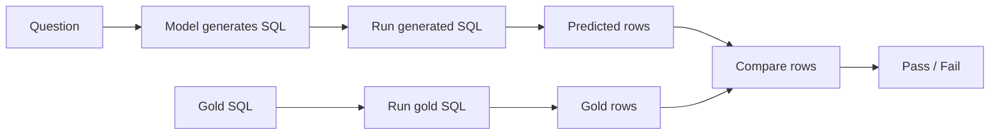
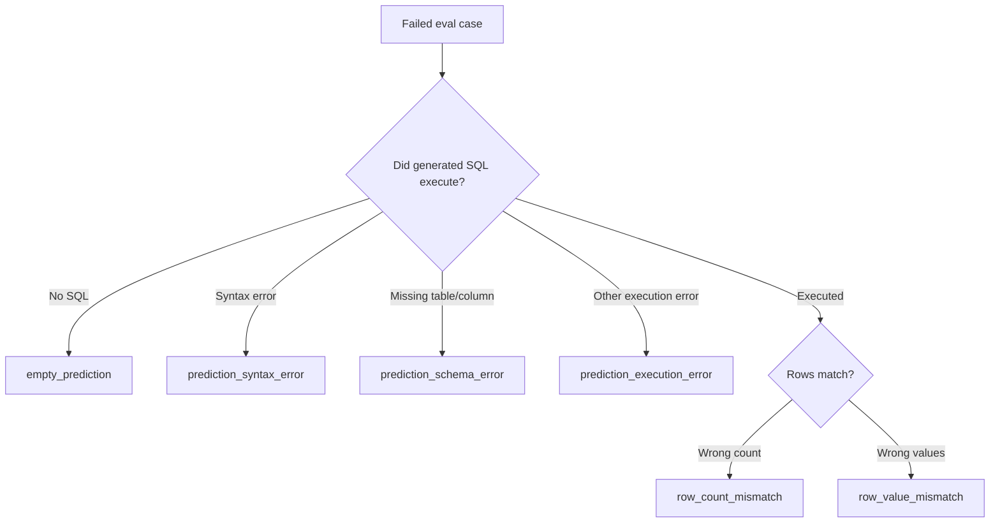
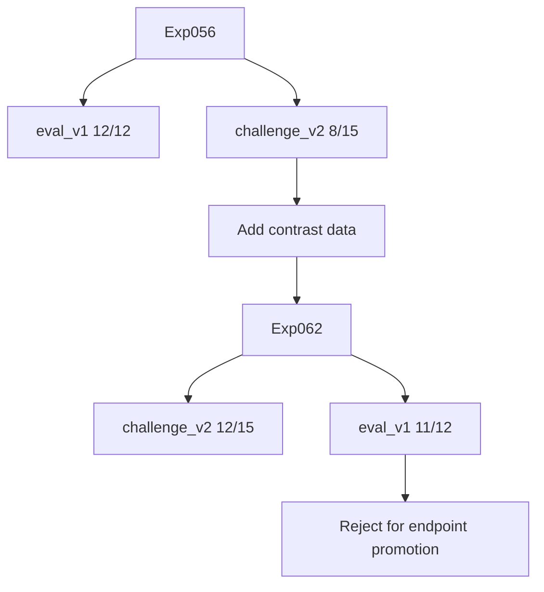

# Eval Design Is the Real Fine-Tuning Backbone

Fine-tuning without eval design is mostly hope.

The model can train successfully. Loss can go down. A few examples can look good by inspection. None of that proves the endpoint is reliable.

For this text-to-SQL lab, eval design was the backbone because the core question was not:

```text
Did the generated SQL look similar to the gold SQL?
```

It was:

```text
Did the generated SQL run on the database and return the right rows?
```

That distinction made the experiment loop useful.

## Why String Match Was Not Enough

SQL has many correct forms.

These two queries can be equivalent:

```sql
SELECT COUNT(*) FROM orders;
```

```sql
SELECT count(*) FROM orders;
```

More complex queries can differ in join order, alias names, whitespace, casing, or expression layout while returning the same result.

So string matching is too brittle.

It can mark correct SQL as wrong just because the string differs.

The repo used result-equivalence eval instead.

Result-equivalence means:

> Run the generated SQL, run the gold SQL, and compare the returned rows.



This is closer to the product requirement. The endpoint does not need to produce the exact same SQL string. It needs to answer the question correctly.

## How Eval Worked

For each eval case, the runner did five things:

1. Render the prompt from the eval row.
2. Ask the model for SQL.
3. Execute the generated SQL against SQLite.
4. Execute the gold SQL against the same SQLite database.
5. Compare the returned rows.

The result record stored:

- case ID
- task ID
- predicted SQL
- pass/fail
- prediction execution error, if any
- gold execution error, if any
- predicted rows
- gold rows

The summary stored:

- experiment ID
- base model
- model variant: base or adapter
- adapter directory
- eval dataset path
- case count
- passed count
- pass rate
- per-case records

That made eval output a real artifact, not a terminal note.

## Row Comparison Rules

The eval row controls two important scoring details:

- `order_sensitive`
- `numeric_tolerance`

`order_sensitive` says whether row order matters.

If it is `false`, the evaluator treats rows as a bag of results. The generated SQL can return the right rows in a different order and still pass.

If it is `true`, row order matters. This is important for queries like:

```sql
ORDER BY revenue DESC LIMIT 1
```

`numeric_tolerance` handles small numeric differences.

For example, if floating point math returns values that differ by a tiny amount, the evaluator can still treat them as equal.

This matters for revenue, ratios, averages, and rounded values.

The key point:

> The eval contract did not just ask "same rows?" It specified how strict the row comparison should be.

## What Counts as Failure

The first level of failure is simple:

```text
pass or fail
```

But pass/fail is not enough to improve the system.

The repo also classified failures into coarse buckets:

- `empty_prediction`
- `prediction_syntax_error`
- `prediction_schema_error`
- `prediction_execution_error`
- `row_count_mismatch`
- `row_value_mismatch`
- `gold_execution_error`

Plain-English meanings:

- `empty_prediction`: model produced no usable SQL
- `prediction_syntax_error`: SQL did not parse
- `prediction_schema_error`: SQL referenced a missing table or column
- `prediction_execution_error`: SQL failed for another runtime reason
- `row_count_mismatch`: SQL ran but returned too many or too few rows
- `row_value_mismatch`: SQL ran and returned the right number of rows, but values were wrong
- `gold_execution_error`: the reference SQL itself failed, which means the eval case is broken



This is where eval becomes engineering.

"The model got it wrong" is not actionable.

"The model put a filter on the wrong side of a left join" is actionable.

## Failure Taxonomy Beyond the Coarse Buckets

The coarse buckets are useful, but text-to-SQL also needs semantic failure labels.

In the storefront lab, the important semantic failures included:

- alias ownership
- boundary semantics
- anti-join predicate placement
- return-ratio denominator
- HAVING/grouped-count logic
- duplicate-producing joins
- support-ticket filters
- revenue discount calculation

These are not all automatic error classes. Some are discovered through failure analysis, tags, and challenge slices.

Here are concrete examples of what those failures look like in the storefront schema. These are simplified examples of the failure shapes.

### Alias Ownership

Alias ownership means the SQL uses the wrong table alias for a column.

Question:

```text
Which customers have unresolved support tickets?
```

Wrong shape:

```sql
SELECT T1.customer_name
FROM customers AS T1
JOIN support_tickets AS T2 ON T1.customer_id = T2.customer_id
WHERE T1.resolved = 0;
```

Problem:

```text
resolved belongs to support_tickets, not customers.
```

Correct shape:

```sql
SELECT T1.customer_name
FROM customers AS T1
JOIN support_tickets AS T2 ON T1.customer_id = T2.customer_id
WHERE T2.resolved = 0;
```

### Boundary Semantics

Boundary semantics means the model gets inclusive/exclusive filters wrong.

Question:

```text
What completed-order revenue was generated on or after 2024-04-01?
```

Wrong shape:

```sql
WHERE T1.order_date > '2024-04-01'
```

Problem:

```text
"on or after" includes 2024-04-01, so > drops valid rows from that date.
```

Correct shape:

```sql
WHERE T1.order_date >= '2024-04-01'
```

### Anti-Join Predicate Placement

Anti-join questions ask for missing related rows, such as customers with no returns or products with no orders.

Question:

```text
Which completed orders have no return?
```

Wrong shape:

```sql
SELECT T1.order_id
FROM orders AS T1
LEFT JOIN returns AS T2 ON T1.order_id = T2.order_id
WHERE T1.status = 'completed'
  AND T2.reason = 'damaged'
  AND T2.return_id IS NULL;
```

Problem:

```text
Filtering T2.reason in WHERE conflicts with T2.return_id IS NULL.
For missing rows, columns from T2 are NULL.
```

Correct shape when asking for no damaged return:

```sql
SELECT T1.order_id
FROM orders AS T1
LEFT JOIN returns AS T2
  ON T1.order_id = T2.order_id
 AND T2.reason = 'damaged'
WHERE T1.status = 'completed'
  AND T2.return_id IS NULL;
```

### Return-Ratio Denominator

Return-ratio errors happen when the numerator is right but the denominator is the wrong population.

Question:

```text
What share of completed orders had a return?
```

Wrong shape:

```sql
COUNT(DISTINCT T2.return_id) * 1.0 / COUNT(DISTINCT T1.order_id)
```

Problem:

```text
This counts return rows, not returned orders. One order can have multiple returned products.
```

Correct shape:

```sql
COUNT(DISTINCT T2.order_id) * 1.0 / COUNT(DISTINCT T1.order_id)
```

And the denominator should stay scoped to completed orders if the question says completed orders.

### HAVING / Grouped-Count Logic

HAVING is needed when filtering after grouping.

Question:

```text
Which customers have more than two support tickets?
```

Wrong shape:

```sql
SELECT T1.customer_name
FROM customers AS T1
JOIN support_tickets AS T2 ON T1.customer_id = T2.customer_id
WHERE COUNT(T2.ticket_id) > 2
GROUP BY T1.customer_id, T1.customer_name;
```

Problem:

```text
WHERE filters rows before grouping. COUNT-based filters belong in HAVING.
```

Correct shape:

```sql
SELECT T1.customer_name
FROM customers AS T1
JOIN support_tickets AS T2 ON T1.customer_id = T2.customer_id
GROUP BY T1.customer_id, T1.customer_name
HAVING COUNT(T2.ticket_id) > 2;
```

### Duplicate-Producing Joins

Some joins multiply rows and inflate aggregates.

Question:

```text
What is the completed-order revenue?
```

Wrong shape:

```sql
SELECT SUM(T2.quantity * T2.unit_price)
FROM orders AS T1
JOIN order_items AS T2 ON T1.order_id = T2.order_id
JOIN support_tickets AS T3 ON T1.order_id = T3.order_id
WHERE T1.status = 'completed';
```

Problem:

```text
If an order has multiple support tickets, joining support_tickets duplicates order_items and inflates revenue.
```

Correct shape:

```sql
SELECT SUM(T2.quantity * T2.unit_price)
FROM orders AS T1
JOIN order_items AS T2 ON T1.order_id = T2.order_id
WHERE T1.status = 'completed';
```

Only join support_tickets if the question actually requires it, and deduplicate or pre-aggregate when needed.

### Support-Ticket Filters

Support-ticket failures often use the wrong boolean or forget the filter.

Question:

```text
How many unresolved support tickets are there?
```

Wrong shape:

```sql
SELECT COUNT(*)
FROM support_tickets
WHERE resolved = 1;
```

Problem:

```text
resolved = 1 means resolved. Unresolved is resolved = 0.
```

Correct shape:

```sql
SELECT COUNT(*)
FROM support_tickets
WHERE resolved = 0;
```

### Revenue Discount Calculation

Revenue failures often forget to apply `discount_pct`.

Question:

```text
What is discounted completed-order revenue?
```

Wrong shape:

```sql
SELECT ROUND(SUM(T2.quantity * T2.unit_price), 2)
FROM orders AS T1
JOIN order_items AS T2 ON T1.order_id = T2.order_id
WHERE T1.status = 'completed';
```

Problem:

```text
This computes gross revenue, not discounted revenue.
```

Correct shape:

```sql
SELECT ROUND(SUM(T2.quantity * T2.unit_price * (1 - T1.discount_pct / 100.0)), 2)
FROM orders AS T1
JOIN order_items AS T2 ON T1.order_id = T2.order_id
WHERE T1.status = 'completed';
```

Example:

```text
row_value_mismatch
```

is the coarse failure.

But the real cause might be:

```text
return-ratio denominator is wrong
```

or:

```text
date boundary used > instead of >=
```

or:

```text
anti-join filter is in WHERE instead of ON
```

That distinction matters because each one points to a different fix.

## Dev, Eval, and Challenge Were Different Jobs

A single eval file is too easy to overfit mentally.

This repo used different eval surfaces for different jobs:

- dev: fast iteration
- protected eval: regression control
- challenge: hard new questions
- DB-disjoint holdout: generalization to different databases, when that was the claim

Dev answered:

```text
Did the change move the thing I was trying to fix?
```

Protected eval answered:

```text
Did I break behavior that should keep working?
```

Challenge answered:

```text
Where is the model still brittle?
```

DB-disjoint holdout answered:

```text
Does this transfer to databases the model did not train on?
```

These are different questions. They should not be collapsed into one number.

## The Exp056 vs Exp062 Lesson

Exp056 was the strongest selected checkpoint:

- dev_v2: 11/12
- eval_v1: 12/12
- challenge_v1: 22/24

Then a new challenge_v2 exposed weaknesses:

- Exp056 challenge_v2: 8/15

So the next experiments added hard-negative contrast data.

Hard-negative contrast data means near-miss examples. The model had already seen the general schema and query shapes. The new rows targeted choices where a small SQL difference changes the result.

Example:

```text
"strictly before 2024-04-01"  -> order_date < '2024-04-01'
"on or before 2024-04-01"    -> order_date <= '2024-04-01'
```

Another example:

```text
"no unresolved support tickets" needs the unresolved-ticket filter inside the LEFT JOIN condition,
then a NULL check after the join.
```

These were not broad data additions. They were slice-owned examples created from the eval failures.

Exp062 improved the newest hard test:

- dev_v2: 12/12
- eval_v1: 11/12
- challenge_v1: 23/24
- challenge_v2: 12/15

That looks tempting. It improved challenge_v2 from 8/15 to 12/15.

But it regressed protected eval_v1 from 12/12 to 11/12.

So the right decision was reject.



This is the cleanest example of eval design doing its job.

The newest challenge found a real weakness. The contrast data improved that weakness. But the protected eval caught a regression.

Without the protected eval, Exp062 might have looked like an obvious win.

## Why Endpoint Eval Is Separate

Offline eval runs inside the local evaluation path.

Endpoint eval calls a live OpenAI-compatible endpoint.

Those are not the same thing.

Offline eval answers:

```text
Does the adapter generate correct SQL in the local eval path?
```

Endpoint eval answers:

```text
Does the served endpoint generate correct SQL when called like a real client?
```

Endpoint eval can catch different failures:

- wrong model name
- base model served instead of adapter
- adapter failed to load
- prompt mismatch
- max token mismatch
- timeout
- server error
- GPU/runtime issue

That is why offline score and endpoint score should be stored separately.

Serving is a separate failure mode.

## Repair and Candidate Pools Are Also Separate

The repo has separate eval paths for:

- one-shot eval
- repair eval
- candidate-pool eval

They answer different questions.

One-shot eval:

```text
Was the first generated SQL correct?
```

Repair eval:

```text
If the first SQL failed, could the model fix it after seeing the error?
```

Candidate-pool eval:

```text
If the model generated multiple SQL candidates, was any candidate correct, and did the selector choose a correct one?
```

The candidate-pool metrics include:

- first-pass rate
- pass@N rate
- selected-pass rate

These should not be mixed with the one-shot score.

If pass@N improves but selected@1 does not, the model can generate a good answer somewhere in the pool but the system cannot reliably pick it.

That is useful information, but it is not the same as endpoint reliability.

## What a Good Eval Record Buys You

A structured eval record lets you answer:

- What dataset was used?
- How many cases passed?
- Which cases failed?
- Did generated SQL execute?
- What rows did it return?
- What rows should it have returned?
- Which failure type was it?
- Which tags or slices were weak?

This is what makes failure analysis possible.

Without per-case records, the score is a dead end.

With per-case records, the next experiment can be targeted.

## Interview Answer

If asked "how did you design eval?", I would say:

```text
I used execution-based result-equivalence, not SQL string match. For each eval case, the model generated SQL, the evaluator ran that SQL against SQLite, ran the gold SQL, and compared returned rows with order sensitivity and numeric tolerance from the eval case.

Then I stored per-case records and classified failures into syntax, schema, execution, row-count, and row-value buckets. On top of that, I used challenge tags to inspect semantic slices like anti-joins, boundary conditions, alias ownership, return-ratio denominators, and HAVING logic.

The important design choice was separating dev, protected eval, challenge, endpoint eval, repair eval, and candidate-pool eval. That is why Exp062 was rejected even though it improved the newest challenge: it regressed the protected eval.
```

Shorter:

```text
The eval was executable and gated. I promoted through gates, not vibes.
```

## Case-Study Sources

Repo artifacts used for this draft:

- `src/sqlbench_lab/sql/evaluator.py`
- `src/sqlbench_lab/sql/eval_runner.py`
- `src/sqlbench_lab/sql/eval_analysis.py`
- `src/sqlbench_lab/sql/eval_types.py`
- `datasets/sql/eval/storefront_sales_lab_eval_v1.jsonl`
- `datasets/sql/eval/storefront_sales_lab_challenge_v2.jsonl`
- `results/sql/qwen35_0_8b__exp056_storefront_v4_lora_r16_a32_d010/`
- `results/sql/qwen35_0_8b__exp062_storefront_v5_lora_r16_a32_d010/`

## Open Questions Before Publishing

- Should this post include real failed SQL examples from Exp062?
- Should endpoint eval be its own post under serving instead of included here?
- Should failure tags be shown as a table from a real `.analysis.json` file?
