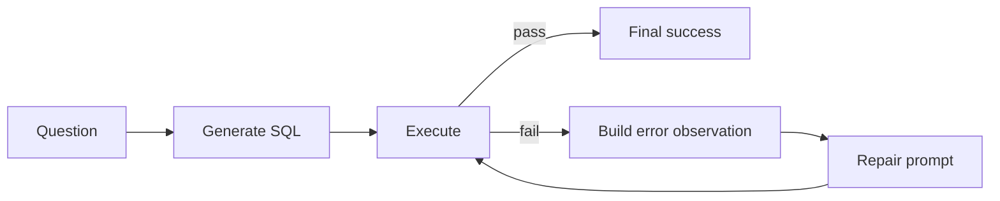

# Repair and Candidate-Pool Workflows

Repair and candidate pools can improve the endpoint workflow.

They do not prove the base generator improved.

That distinction matters.

## One-Shot Score

One-shot eval asks:

```text
Was the first generated SQL correct?
```

This is the cleanest measurement of the adapter as a direct SQL generator.

It should be tracked first.

## Execution-Guided Repair

Execution-guided repair means:

1. Generate SQL.
2. Execute it.
3. If it fails, capture the error or mismatch.
4. Send the failed SQL and observation back to the model.
5. Ask for repaired SQL.
6. Evaluate again.



Repair eval should track:

- first-pass count
- first-pass rate
- final-pass count
- final-pass rate
- repair attempt count
- repair success count
- repair failure types
- max repair attempts

The key rule:

```text
first-pass score and final repair score must both be visible
```

If final score improves but first-pass score regresses, the endpoint got more dependent on repair.

That might be acceptable, but it should be explicit.

## Candidate-Pool Eval

Candidate-pool eval asks the model for multiple SQL candidates.

It tracks:

- first candidate passed
- any candidate passed
- selected candidate passed

The rates are:

- first-pass rate
- pass@N rate
- selected-pass rate

Plain meaning:

- first-pass: did the first SQL work?
- pass@N: was any SQL in the pool correct?
- selected@1: did the system choose a correct SQL as final?

These are different.

If pass@N is high but selected@1 is low, the model can produce a correct answer somewhere, but the system cannot reliably pick it.

That is useful research signal, not endpoint reliability.

## Why These Scores Stay Separate

Do not collapse:

```text
one-shot + repair + pass@N + selected@1
```

into one number.

They answer different questions:

- one-shot: base generator quality
- repair: workflow recovery ability
- pass@N: search-space quality
- selected@1: selection quality

Mixing them hides regressions.

Example:

```text
one-shot gets worse
repair gets better
final score looks flat
```

If only final score is tracked, the team may miss that the model became more dependent on extra calls.

## Where Repair Belongs in the Endpoint

For a real text-to-SQL endpoint, repair is useful.

But it should be a workflow gate after one-shot eval:

```text
one-shot eval
-> repair eval
-> candidate-pool eval
-> endpoint eval
-> load test
```

Repair also has production costs:

- extra model calls
- higher latency
- more tokens
- more failure modes
- possible repeated bad SQL

So repair is not free.

## Interview Answer

```text
I would add execution-guided repair, but I would track it as a separate workflow. One-shot score tells me whether the adapter improved as a direct SQL generator. Repair score tells me whether the system can recover after an execution failure. Candidate-pool pass@N tells me whether a correct SQL appears somewhere in multiple samples. Selected@1 tells me whether the system can actually choose the right one.

Those metrics should not be collapsed, because repair or pass@N can hide a regression in the base generator.
```

Short line:

```text
Repair is a workflow improvement, not proof the base generator improved.
```

## Sources

- `src/sqlbench_lab/sql/eval_runner.py`
- `src/sqlbench_lab/sql/eval_types.py`
- `src/sqlbench_lab/sql/eval_analysis.py`
- `src/sqlbench_lab/cli.py`
